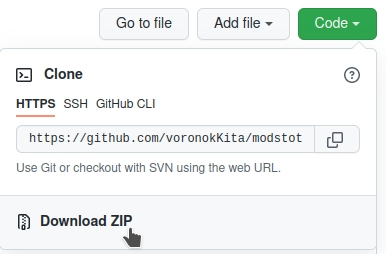

# Mods To The People

Paradox makes wonderful games, that become even better with help of mod-creators community. 
In those cases when Steam Workshop isn't accessible, or you don't want to use it, mods installation becomes a boring monotonous job. This script will help you to transition from inefficient manual labor to machine-working.

### Here is how it works

0. unpack your mods, give to the folders some simple names
1. put the mods and the script into '/Paradox Interactive/your game folder/mod/'
2. run terminal command 'python3 mttp.py'
3. or 'python3 mttp.py [your game version]'

The script can be used for a cleanup, if you change your set of mods then it removes old files & records.

## Detailed

You'll need Python 3 installed. It comes with Ubuntu by default and can be included in other OS as well. Check in the terminal:
> python3 --version

You can get it here https://www.python.org/downloads/ 
If you stuck then search "install python 3 in [your OS]", there are many detailed guides out there.

The script will definitely work on EU4 and HOI4, and probably on other games from this list:
> https://en.wikipedia.org/wiki/Paradox_Development_Studio#List_of_games_developed

You install mods in the "Paradox Interactive" folder, that will be created after the first lunch of a game. On Windows and Mac it will be created in your 'Documents' folder, on Linux in '~/.local/share/' of your home catalog. 
Normal order of mod installation in Europa Universalis IV by hands is:

0. Copy descriptor.mod, that normally found inside a mod folder, into the 
/Paradox Interactive/Europa Universalis IV/mod/ 
1. in the end of this descriptor file add a new line 
path="path to the mod's folder" 
2. Next you enable the mod by making/editing this file 
/Paradox Interactive/Europa Universalis IV/dlc_load.json 
format of the file is this 
{"disabled_dlcs" :[], "enabled_mods": ["mod/mod name 1.mod", "mod/mod name 2.mod", "mod/mod name 3.mod"]}

If this how it works in your case then the script must work, regardless of your OS and a path to the "Paradox Interactive" folder!

#### I'm new to GitHub and don't know how to download

