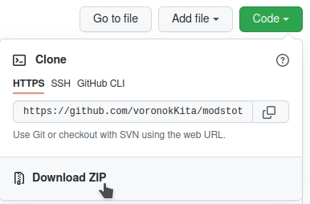

# Моды Для Народа

Парадоксы делают отличные игры, которые становятся ещё лучше благодаря сообществу мододелов. 
В тех случах, когда Мастерская Стим недоступна, или вы не хотите ей пользоваться, установка модов превращаяется в унылую монотонную работу. Этот скрипт поможет вам перейти с неэффективного ручного труда на машинный.

### Вот всё что нужно сделать

0. распаковать моды, (дать папкам удобные названия если хотите)
1. положить их вместе со скриптом в '/Documents/Paradox Interactive/папка игры/mod/'
2. выполнить в этой папке в терминале команду 'python3 mttp.py'
3. или 'python3 mttp.py [версия вашей игры]' чтобы перезаписать её

Если вы удалили часть папок или поменяли набор, то он удалит лишнее.

## Подробнее

Вам нужен установленный интерпретатор Python 3. Он установлен по умолчанию в Ubuntu, может быть в комплекте и других ОС. Проверьте в терминале:

> python3 --version

Можно скачать тут https://www.python.org/downloads/ 
Если что-то не получается, то поищите "установка python на [ваша ОС]", в сети много подробных руководств.

Скрипт точно будет работать на EU4 и HOI4, вероятно и на остальных играх из этого списка:

> https://en.wikipedia.org/wiki/Paradox_Development_Studio#List_of_games_developed

Моды устанавливаются в папку 'Paradox Interactive', которая создаётся после первого запуска игры. На Windows и в Mac она появляется в ваших 'Документах', а на Linux в '~/.local/share/' домашнего каталога. 
Нормальный способ установить моды в Europa Universalis IV ручками такой:

0. Скопировать descriptor.mod, обычно лежит в папке с модом, в папку 
/Paradox Interactive/Europa Universalis IV/mod/ 
1. в конце этого descriptor файла добавить строку 
path="путь к папке с модом" 
2. Чтобы включить этот мод в игре, нужно создать/отредактировать файл 
/Paradox Interactive/Europa Universalis IV/dlc_load.json 
формат файла такой 
{"disabled_dlcs": [], "enabled_mods": ["mod/имя мода 1.mod", "mod/имя мода 2.mod", "mod/имя мода 3.mod"]}

Если моды устанавливаются так, то скрипт должен работать, независимо от вашей ОС и пути к папке 'Paradox Interactive'!

#### Я впервые на GitHub и не знаю как скачать

